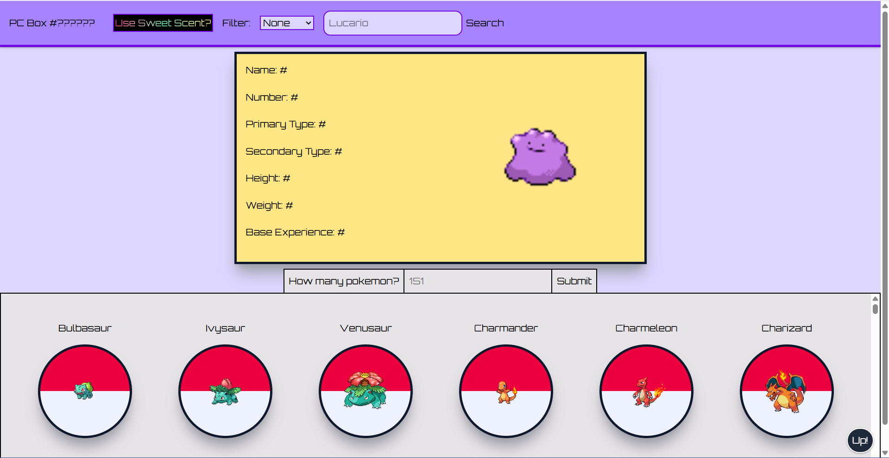
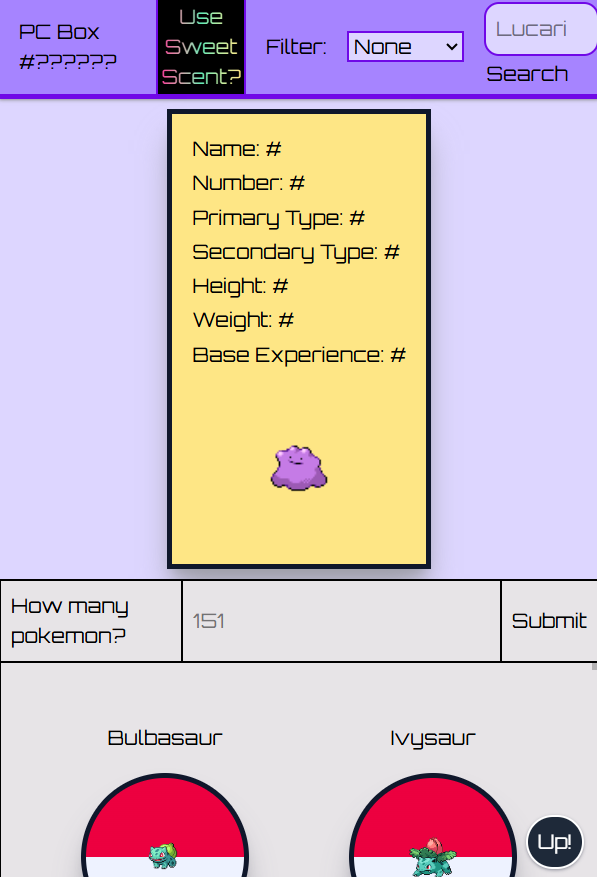
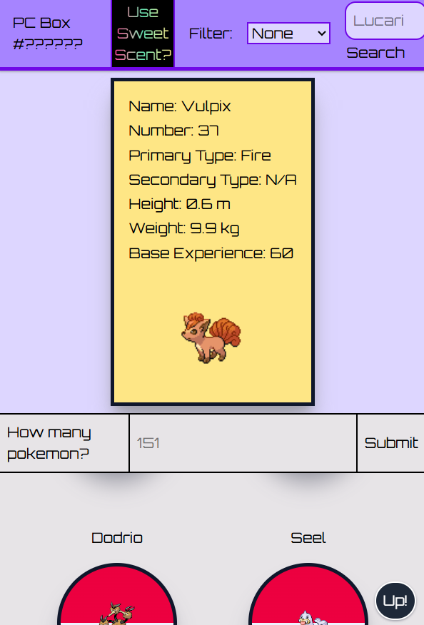

# Pokédex Explorer
By Esaih Velasquez and Josiah Park
A site using pokeAPI to create a "PC Box" to scroll through and look into, filtered to show all pokemon one desired and filter out the ones unneeded.
Utilizes the Tailwind, JavaScript, HTML, JQuery, Googlefonts, Github, Reference images and infinite fusion dex as a reference for the Pokémon grid.
API's used are Pokéapi and Google fonts
Features a filter option, a pokemon limiter to set how many you wish to see, a search bar for pokemon, their latest cry as recorded in the API, their lore stats (not gameplay stats) and typing in the Infobox, Random Pokémon Generator, and a to-the-top button for the Pokémon list.
Challenges came from creating themes using tailwind, comprehending asynchronous functions, making classes and fonts with tailwind and properly spacing the design of the website to be compact enough.
We learned how to use arbitrary values for tailwind, how to use fetch request in a practical way and animation mixing with tailwind and jQuery.

